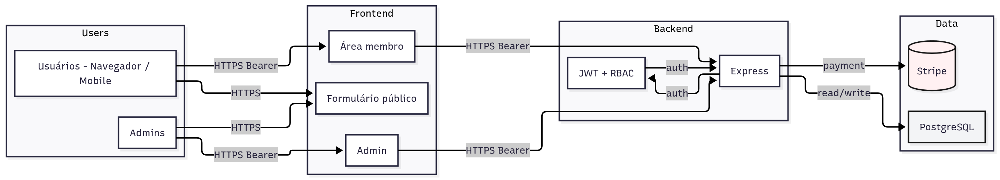
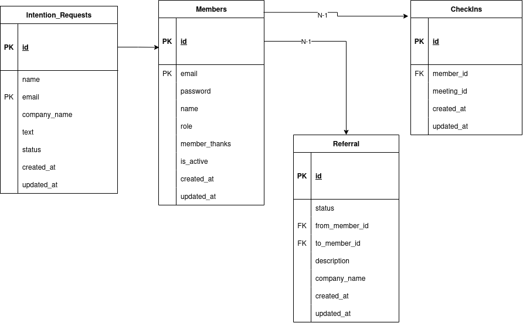

<h1 align="center"> Teste Técnico  Desenvolvedor Fullstack </h1>

<br>

## Diagrama da Arquitetura
<p align="center">
  
</p>

---

## Modelo de Dados
<p align="center">
  
</p>

---

## Estrutura de Componentes(Frontend)

```
src/
 ├─ app/
 │   ├─ (public)/             → página pública (intenção de participação)
 │   │   ├─ components/       → componentes reutilizaveis que podem ser usados apenas em (public)
 │   │   └─ page.tsx          → página inicial
 │   │   └─ any-folder/      → componentes não reutilizaveis que podem ser usados apenas em (public)
 |   |
 │   ├─ admin/                → área administrativa protegida
 │   │   ├─ components/       → componentes reutilizaveis que podem ser usados apenas em (admin)
 │   │   └─ page.tsx          → página inicial
 │   │   └─ layout.tsx        → layout base para admin
 │   │   └─ any-folder/       → componentes não reutilizaveis que podem ser usados apenas em (admin)
 |
 │   ├─ members/              → página privada de membros
 │   │   ├─ components/       → componentes reutilizaveis que podem ser usados apenas em (members)
 │   │   └─ page.tsx          → página inicial
 │   │   └─ layout.tsx        → layout base para membros
 │   │   └─ any-folder/       → componentes não reutilizaveis que podem ser usados apenas em (members)
 │   ├─ layout.tsx            → layout base (header, footer, providers)
 │   └─ globals.css
 │
 ├─ components/
 │   ├─ ui/                   → componentes vindos do Shadcn
 │   ├─ any-component.tsx     → componentes reutilizaveis que podem ser usados em vários lugares
 │
 ├─ hooks/                    → hooks criados (useFetchIntentios, usePagination)
 │
 ├─ lib/                      → utilitários (twMerge, helpers)
```

---

## Definição da API

### 1. Submissão de Intenção de Participação (Público)

Este endpoint é usado pelo formulário público para submeter novas intenções de participação.

    Endpoint: /applications

    Método: POST

    Autenticação: Nenhuma (Público)

    Descrição: Cria um novo registro de intenção de participação via formulário público.

- Request Body (JSON)

```json
{
  "name": "João Silva",
  "email": "joao.silva@exemplo.com.br",
  "company": "Tech Solutions S.A.",
  "text": "Quero expandir minha rede de contatos e gerar novas oportunidades de negócio na área de TI."
}
```

- Response (Status 201: Created)

### 2. Gestão de Intenção (Admin)

Este endpoint permite que um administrador atualize o status de uma intenção de participação.

    Endpoint: /admin/applications/status

    Método: PUT

    Autenticação: Obrigatória (Bearer {{ADMIN_TOKEN}})

    Descrição: Atualiza o status de uma intenção de participação para 'approved' ou 'rejected'. Se aprovado, o backend deve gerar e retornar o token de cadastro completo.

➡️ Request Body (JSON)

Para Aprovar:

```json
{
  "id": 1,
  "status": "approved"
}
```

Para Repovar:

```json
{
  "id": 2,
  "status": "rejected"
}
```

- Response (Status 204: No Content)
- Response (Status 404: Not Found)

### 3. Ver a lista de todas as intenções submetidas (Admin)

Este endpoint permite que um administrador veja todas as intenções de participação.

    Endpoint: /admin/applications

    Método: GET

    Autenticação: Obrigatória (Bearer {{ADMIN_TOKEN}})

    Descrição: Retorna uma lista com todas as intenções de participação.

- Request No Body

- Response (Status 200: OK)

```json
[
  {
  "id":1,
  "name": "João Silva",
  "email": "joao.silva@exemplo.com.br",
  "company": "Tech Solutions S.A.",
  "text": "Quero expandir minha rede de contatos e gerar novas oportunidades de negócio na área de TI.",
  "status": "approved",
  "createdAt": "2025-11-04T20:05:00.000Z",
  "updatedAt": "2025-11-04T20:05:00.000Z"
  }
]
